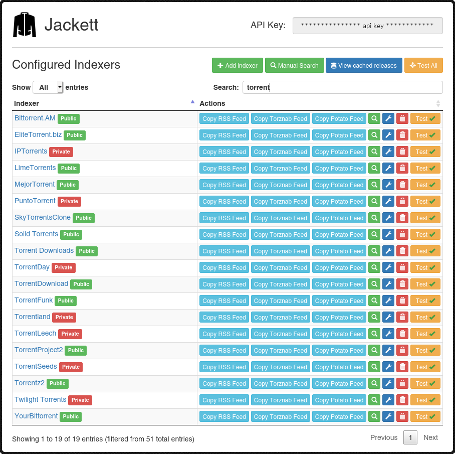
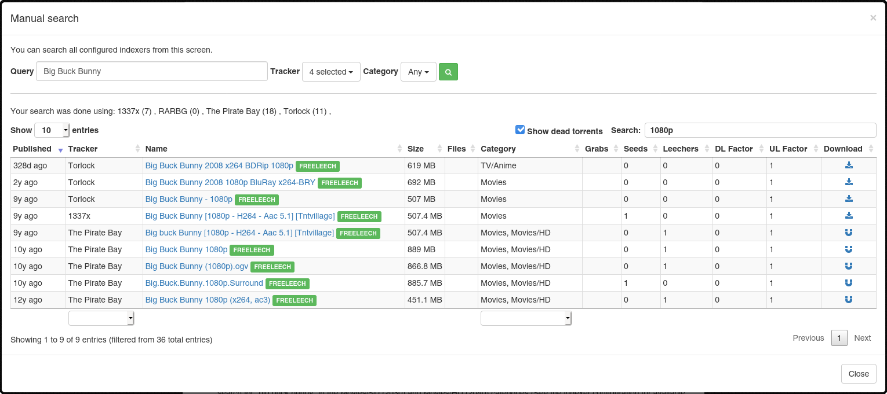

# Jackett

More trackers for Sonarr, Radarr, Lidarr and other arrs.

## Docker

This Docker image is using [Ubuntu 22.04](https://hub.docker.com/_/ubuntu/) as base image. Jackett runs as a user with the id `1000`.

## Running Jackett behind a reverse proxy

Reverse Proxy instructions are from the [Jackett/Jackett README.md](https://github.com/Jackett/Jackett#running-jackett-behind-a-reverse-proxy):

When running Jackett behind a reverse proxy make sure that the original hostname of the request is passed to Jackett. If HTTPS is used also set the X-Forwarded-Proto header to "https". Don't forget to adjust the "Base path override" Jackett option accordingly.

Example config for apache:

```apacheconf
<Location /jackett>
    ProxyPreserveHost On
    RequestHeader set X-Forwarded-Proto expr=%{REQUEST_SCHEME}
    ProxyPass http://127.0.0.1:9117
    ProxyPassReverse http://127.0.0.1:9117
</Location>
```

Example config for Nginx:

```apacheconf
location /jackett {
    proxy_pass http://127.0.0.1:9117;
    proxy_set_header X-Real-IP $remote_addr;
    proxy_set_header X-Forwarded-For $proxy_add_x_forwarded_for;
    proxy_set_header X-Forwarded-Proto $scheme;
    proxy_set_header X-Forwarded-Host $http_host;
    proxy_redirect off;
}
```

## Ports

| Port     | Description | Required |
| -------- | ----------- | -------- |
| 9117/tcp | Web ui      | Yes      |

## Images




Images are from the [Jackett/Jackett README.md](https://github.com/Jackett/Jackett#screenshots)

## Need help?

- Email: [tlovinator@gmail.com](mailto:tlovinator@gmail.com)
- Discord: TheLovinator#9276
- Steam: [TheLovinator](https://steamcommunity.com/id/TheLovinator/)
- Send an issue: [jackett/issues](https://github.com/Feed-The-Fish/jackett/issues)
